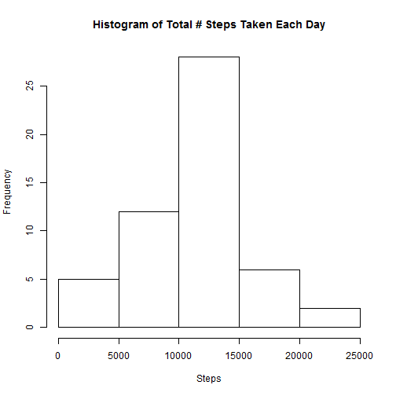
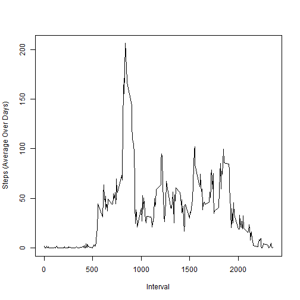
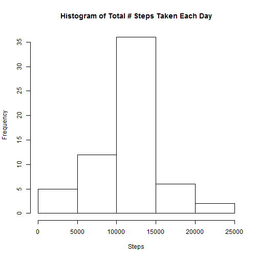
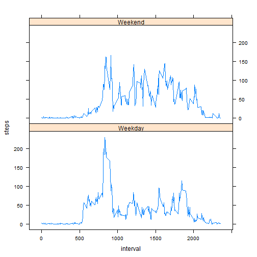

##Loading and preprocessing the data##


```r
rawData <- read.csv("activity.csv",header=TRUE)
rawData$date <- as.Date(rawData$date,"%Y-%m-%d")
rawDataDim <- dim(rawData)
numObservations <-rawDataDim[1]
numVar <- rawDataDim[2]
partialData<- na.omit(rawData)
rownames(partialData)<-NULL
```
The # of observations in the raw data: 17568.  
The # of variables in the raw data: 3.

##What is mean total number of steps taken per day?##

1.Make a histogram of the total number of steps taken each day

```r
# Total number of steps taken per day
partial.totalSteps<-by(partialData$steps,partialData$date,sum)
hist(partial.totalSteps,xlab="Steps",main="Histogram of Total # Steps Taken Each Day")
```

 

2.Calculate and report the mean and median total number of steps taken per day

```r
partial.meanSteps <- as.integer(round(mean(partial.totalSteps)))
partial.medSteps <- median(partial.totalSteps)
```
Mean steps (Partial Data): 10766 steps.  
Median Steps (Partial Data): 10765 steps.

##What is the average daily activity pattern?##

1.Make a time series plot (i.e.  type = "l" ) of the 5-minute interval (x-axis) and the average number of steps taken, averaged across all days (y-axis).


```r
plotData<-tapply(partialData$steps,partialData$interval,mean)
plotInterval<-as.numeric(names(plotData))
plot(plotInterval,plotData,type = "l", xlab="Interval" , ylab="Steps (Average Over Days)")
```

 

2.Which 5-minute interval, on average across all the days in the dataset, contains the maximum number of steps?

```r
partial.maxSteps <- as.integer(round(max(plotData)))
ind<-which(plotData %in% max(plotData))
Intervals.maxSteps<-plotInterval[ind]
```
Max # of steps (Partial Data): 206.  
Max step at interval: 835.

##Imputing missing values##

1.Calculate and report the total number of missing values in the dataset (i.e. the total number of rows with  NA s)

```r
numNA <- sum(is.na(rawData))
```

Total # of "NA": 2304.

2.Devise a strategy for filling in all of the missing values in the dataset. The strategy does not need to be sophisticated. For example, you could use the mean/median for that day, or the mean for that 5-minute interval, etc.

```r
meanByInterval<-tapply(partialData$steps,partialData$interval,mean,simply=TRUE)
meanByInterval<-round(meanByInterval)
```


3.Create a new dataset that is equal to the original dataset but with the missing data filled in.

```r
temName<-as.numeric(names(meanByInterval))
newData<-rawData;
for (i in 1:length(temName)){
  indTem <- (is.na(newData$steps) & newData$interval==temName[i])
  ind<-which(indTem %in% "TRUE")
  newData$steps[ind]<-meanByInterval[i]
}
```
4.Make a histogram of the total number of steps taken each day and Calculate and report the mean and median total number of steps taken per day. Do these values differ from the estimates from the first part of the assignment? What is the impact of imputing missing data on the estimates of the total daily number of steps?


```r
new.Steps <- by(newData$steps,newData$date,sum)
hist(new.Steps,xlab="Steps",main="Histogram of Total # Steps Taken Each Day")
```

 

```r
new.meanSteps<-as.integer(round(mean(new.Steps)))
new.medSteps<-as.integer(round(median(new.Steps)))
```
Mean Steps (New Data): 10766.  
Median Steps (New Data): 10762.  
Absolute Mean Step Difference between New Data and Partial Data: 0  
Absolute Median Step Difference between New Data and Partial Data: 3  
There is no reported difference in the mean of both histograms. However, the median is slightly different in the two histograms. The imputing miss data does not have a major effect on the new histogram.


##Are there differences in activity patterns between weekdays and weekends?##

1.Create a new factor variable in the dataset with two levels -- "weekday" and "weekend" indicating whether a given date is a weekday or weekend day.

```r
Days <- weekdays(newData$date)
Days<-ifelse(Days %in% c("Saturday","Sunday"),"Weekend","Weekday")
newData<-data.frame(newData,Day = Days)
```

2.Make a panel plot containing a time series plot (i.e.  type = "l" ) of the 5-minute interval (x-axis) and the average number of steps taken, averaged across all weekday days or weekend days (y-axis). The plot should look something like the following, which was created using simulated data:


```r
library(lattice)
splitData<-split(newData,newData$Day)
w1<-by(splitData$Weekend$steps,splitData$Weekend$interval,mean)
w2<-by(splitData$Weekday$steps,splitData$Weekday$interval,mean)
Weekends<-cbind(steps=as.numeric(w1),interval=as.numeric(names(w1)))
Weekends<-cbind(Weekends,Day=rep("Weekend",length(w1)))

Weekdays<-cbind(steps=as.numeric(w2),interval=as.numeric(names(w2)))
Weekdays<-cbind(Weekdays,Day=rep("Weekday",length(w2)))

Weekz<-data.frame(rbind(Weekends,Weekdays))
Weekz$steps<-as.numeric(as.character(Weekz$steps))
Weekz$interval<-as.integer(as.character(Weekz$interval))
xyplot(steps ~ interval | Day, data = Weekz,layout=c(1,2),type="l")
```

 

